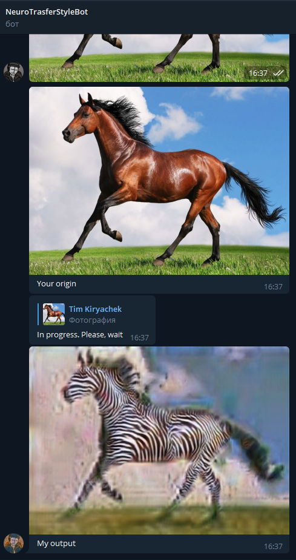
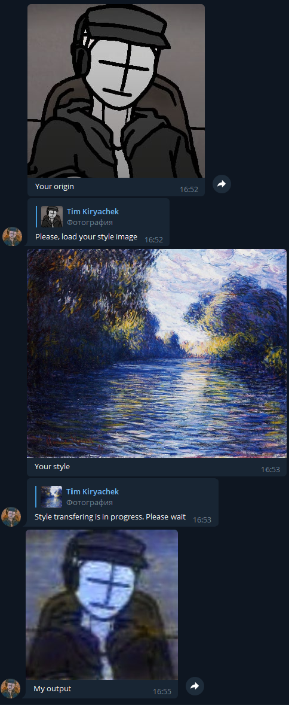

# NeuroTransferStylerBot
Simple ML models-based [Telegram bot](https://t.me/neuro_transfer_style_bot) which can transfer style of one image to another one using Gram matrices.
Besides, it can turn horses in picture into zebras using CycleGAN (weights were taken [here](https://github.com/Lornatang/CycleGAN-PyTorch)).

## Details
Bot can be launched in `main.py` (before you have to insert your token of bot in `bot_init.py`). 
Style Transfering was implemented in `style_transfering.py`, cycleGAN - in `cyclegan.py` and `cycleGAN_generator.py`

## Heroku
Project was deployed to heroku.com. But because of restrictions connected with 
free plan on heroku pictures have to be shrunk very much so quality would be far from good.

## Examples of work
### Horse to zebra:

### Style Transfering

Here is [demonstration](https://youtu.be/_rhG538VT2U) of the bot's work on local machine CPU
